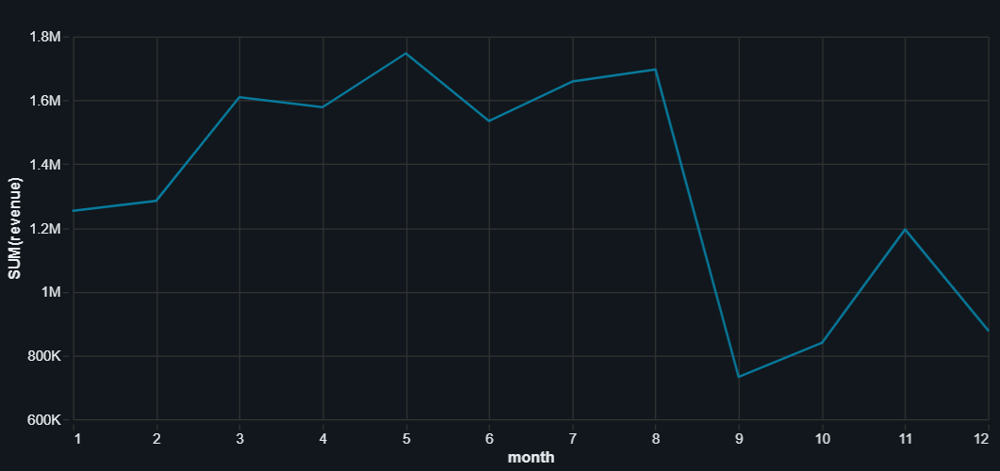
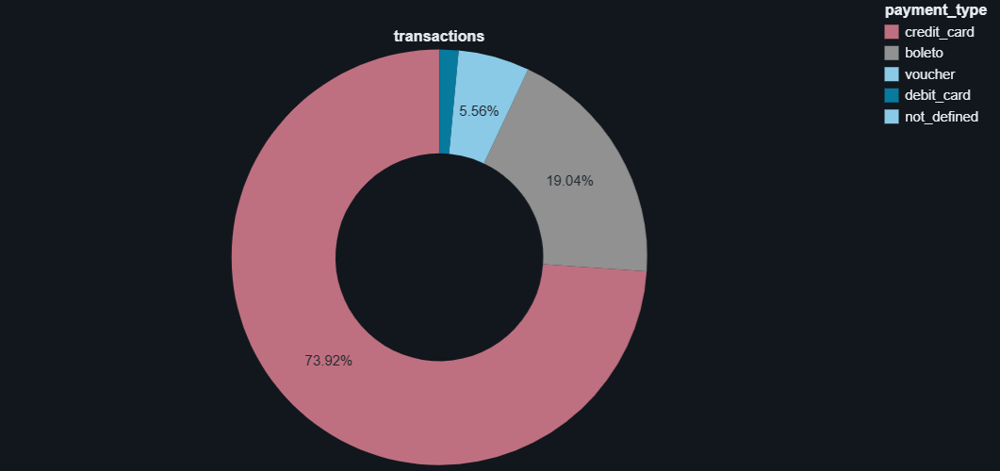
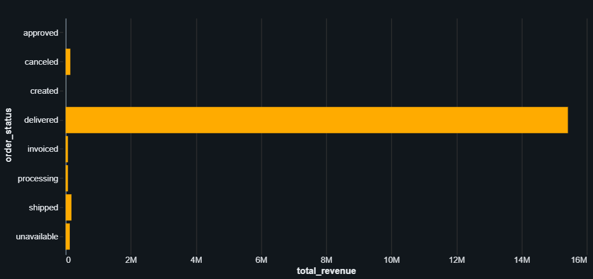
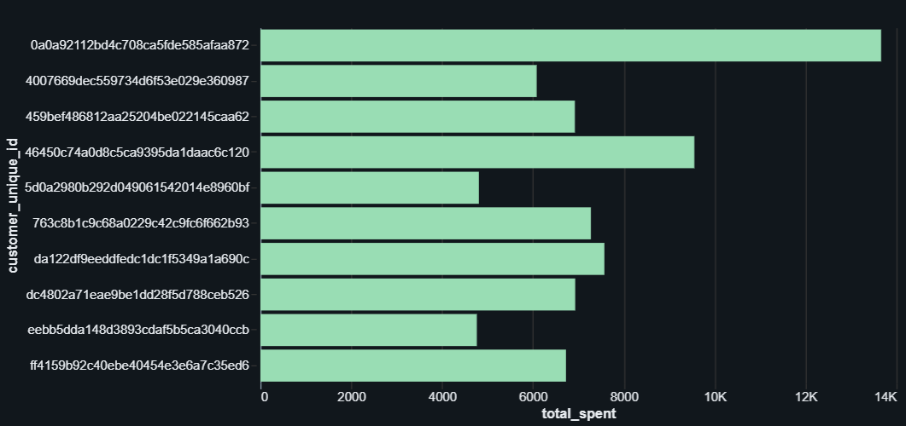

#  Retail Data Lakehouse using Databricks, PySpark & SQL

##  Project Overview

This project demonstrates the implementation of an end-to-end Data Lakehouse architecture using Databricks, PySpark, and SQL on a real-world e-commerce dataset.

The pipeline follows the Medallion Architecture (Bronze → Silver → Gold) to transform raw transactional data into business-ready analytical datasets. The final Gold Layer provides insights into revenue trends, customer behavior, payment preferences, and order performance.

---

##  Business Objectives

- Analyze revenue trends over time
- Identify top-spending customers
- Understand customer payment preferences
- Monitor order fulfillment performance
- Build analytics-ready datasets for reporting and dashboards

---

##  Tech Stack

- Databricks
- Apache Spark (PySpark)
- SQL
- Python
- Delta Lake Concepts
- Git & GitHub

---

##  Dataset

Brazilian E-Commerce Public Dataset (Olist)

Datasets Used:

- Orders Dataset
- Customers Dataset
- Payments Dataset

---

#  Architecture

```text
Raw CSV Files
      │
      ▼
Bronze Layer
(Raw Data Storage)
      │
      ▼
Silver Layer
(Data Cleaning & Standardization)
      │
      ▼
Gold Layer
(Business Aggregations & Analytics)
      │
      ▼
SQL Analytics
      │
      ▼
Visualizations
```

---

#  Bronze Layer

Raw datasets were ingested into Databricks and stored without modifications.

Tables:

- orders_bronze
- customers_bronze
- payments_bronze

### Activities Performed

- CSV Ingestion
- Schema Detection
- Raw Data Storage

---

#  Silver Layer

Data quality improvements and transformations were applied.

### Activities Performed

- Removed duplicate records
- Handled null values
- Standardized schemas
- Converted timestamp fields
- Prepared clean analytical datasets

Tables:

- orders_silver
- customers_silver
- payments_silver

---

#  Gold Layer

Business-ready aggregated tables were created.

### Gold Tables

| Table | Description |
|---------|-------------|
| gold_monthly_revenue | Monthly revenue trend |
| gold_revenue_status | Revenue by order status |
| gold_payment_analysis | Payment method analysis |
| gold_top_customers | Highest spending customers |

---

#  SQL Analytics

Business questions answered:

### Revenue Analysis

- How does revenue change over time?

### Customer Analysis

- Who are the top customers?

### Payment Analysis

- Which payment methods are most preferred?

### Order Analysis

- Which order statuses generate the highest revenue?

---

#  Visualizations

## 1. Monthly Revenue Trend

Shows revenue growth across months.



---

## 2. Payment Method Analysis

Distribution of payment methods used by customers.



---

## 3️. Revenue by Order Status

Comparison of revenue generated by different order statuses.



---

## 4️. Top Customers Analysis

Highest spending customers based on total transaction value.



---

#  Key Outcomes

- Built a complete Bronze-Silver-Gold Data Lakehouse architecture.
- Processed real-world retail datasets using PySpark.
- Performed large-scale transformations and aggregations.
- Generated business-ready analytical datasets.
- Created visual insights for decision-making.

---

##  Author

**Pavithra**

Aspiring Data Engineer | Python | SQL | PySpark | Databricks
